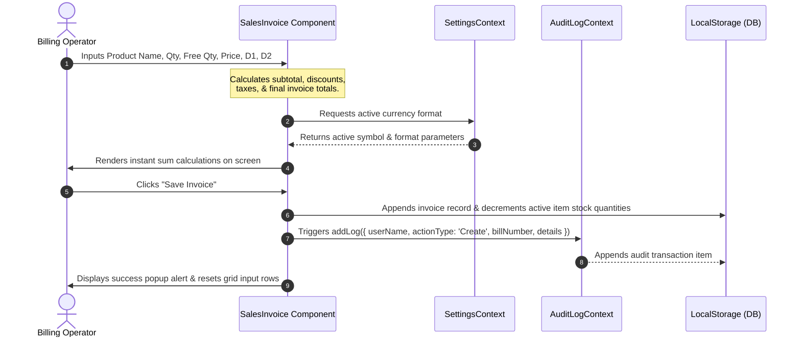
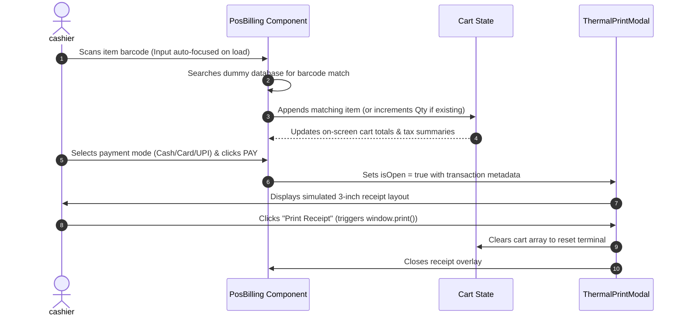

# System Architecture Document

This document defines the system architecture, directory structure, data flow patterns, state management strategies, and module integrations for the **Os Books (The Digital Accounting Book)** frontend application.

---

## 1. Technological Stack

The application runs as a modern single-page application (SPA) on a client-side stack:

*   **Core Framework**: React 19 (handling component lifecycles, virtual DOM rendering, and hooks).
*   **Build System & Bundler**: Vite 8 (providing quick hot module replacement (HMR) and optimized rollup production bundling).
*   **Styling Engine**: TailwindCSS 4 (integrated via PostCSS for utility-first responsive class structures and CSS variable definitions).
*   **Routing Manager**: React Router DOM 7 (managing URL configurations, path mappings, and browser history objects).
*   **Charts & Visualizations**: Recharts 3 (rendering interactive svg curves for sales and purchase analytics).
*   **Internationalization (i18n)**: i18next, react-i18next, and i18next-browser-languagedetector (managing multi-language localizations and active language states).
*   **Utility Icons**: Lucide React (standardized svg vector graphic interfaces).
*   **Document Generators**:
    *   `html2canvas` (converts HTML viewport divs into image canvases).
    *   `jsPDF` (compiles images and tables into downloadable multi-page A4 PDF files).
*   **Clsx & Tailwind-merge**: Custom utility helpers (`src/utils.js`) for conditionally combining class names.

---

## 2. Directory Layout & Core Files

The workspace is structured into specialized functional layers within the `src/` folder:

```
src/
├── api/                  # Base integrations (if any)
├── assets/               # Branding assets, logotypes, and stylesheets
├── components/           # Reusable master modals, charts, inputs, and layouts
│   ├── AlertCards.jsx
│   ├── BalanceCorrectionModal.jsx
│   ├── BomMasterModal.jsx
│   ├── BranchMasterModal.jsx
│   ├── CashBankMasterModal.jsx
│   ├── CategoryMasterModal.jsx
│   ├── ChartSection.jsx
│   ├── ChequeStatus.jsx
│   ├── CollectionReportModal.jsx
│   ├── EmployeeMasterModal.jsx
│   ├── ExpenseMasterModal.jsx
│   ├── FooterShortcuts.jsx
│   ├── GstUqcMergeModal.jsx
│   ├── HardRefreshModal.jsx
│   ├── HoldInvoiceModal.jsx
│   ├── ImportDataModal.jsx
│   ├── ImportInvoiceAIModal.jsx
│   ├── IncomeMasterModal.jsx
│   ├── ItemMasterModal.jsx
│   ├── LoadingSheetModal.jsx
│   ├── MessageTemplateModal.jsx
│   ├── OfferManagementModal.jsx
│   ├── Pagination.jsx
│   ├── PartyMasterModal.jsx
│   ├── PaymentMasterModal.jsx
│   ├── ProductMasterModal.jsx
│   ├── SettingsDrawer.jsx
│   ├── Sidebar.jsx
│   ├── StatCard.jsx
│   ├── StockCorrectionModal.jsx
│   ├── SummaryCard.jsx
│   ├── TopNavbar.jsx
│   ├── UnitCatalogMasterModal.jsx
│   ├── UnitConversionModal.jsx
│   ├── WarehouseMasterModal.jsx
│   └── WhatsAppReminderModal.jsx
├── context/              # Context providers for global state management
│   ├── AuditLogContext.jsx
│   └── SettingsContext.jsx
├── layouts/              # Core layout templates
│   └── DashboardLayout.jsx
├── locales/              # Multi-language locale dictionary configuration JSONs
├── pages/                # Individual page route entry-point components
│   ├── Dashboard.jsx
│   ├── FirmRegistration.jsx
│   ├── SalesInvoice.jsx
│   ├── SalesInvoiceSummary.jsx
│   ├── StockDetails.jsx
│   ├── BankDetails.jsx
│   └── (remaining 77 pages...)
├── App.css               # Base layout classes and custom components styling
├── App.jsx               # Central router mapping and context encapsulation
├── i18n.js               # i18next initial setups and detectors registry
├── index.css             # Tailwind imports, custom font faces, and scrollbar configs
├── main.jsx              # DOM mounting wrapper attaching StrictMode
└── utils.js              # Class merger utilities (cn)
```

---

## 3. Component Hierarchy

All pages are encapsulated within standard system layouts that manage screen sizes and menus:

```
[ App.jsx ] (Encapsulates Routers & Providers)
    │
    ▼
[ SettingsProvider ] ──► [ AuditLogProvider ]
    │
    ▼
[ DashboardLayout ] (Layout Controller)
    ├── [ Sidebar ] (Sidebar Navigation + Search Filters + Modal Triggers)
    ├── [ TopNavbar ] (Utilities + Alerts + Print + Profile + i18n Select)
    │
    ├── [ Routing View ] (Loads page routes based on paths: e.g. /admin/pos)
    │
    └── [ FooterShortcuts ] (Sticky keyboard helpers, visible on /dashboard only)
```

---

## 4. State Management Architecture

The application implements a local-first state pattern:

### 4.1 React Contexts
1.  **SettingsContext (`src/context/SettingsContext.jsx`)**:
    *   Manages user currency settings (active symbols, formatting metrics).
    *   Holds functional flags (e.g. `showPurchaseOrder`, `showSalesOrder`, `showCustomerChallan`) that dynamically alter the navigation items in [Sidebar.jsx](file:///c:/Users/divya/Downloads/account%20frontend%2004/src/components/Sidebar.jsx).
2.  **AuditLogContext (`src/context/AuditLogContext.jsx`)**:
    *   Acts as an inline event broker. Provides the `addLog` function to components to dispatch changes (e.g., invoices created or stock deletions).
    *   Maintains the active log memory array.

### 4.2 Web Storage Providers
-   **LocalStorage**:
    *   Used for persistent records like catalog lists (`bankDetailsRows`, product definitions, firm details).
    *   Stores `i18nextLng` locale selections.
-   **SessionStorage**:
    *   Used for temporary transaction details (e.g. active checkout lists, screen-level cache details).
    *   Cleared immediately on user-triggered hard refresh operations.

---

## 5. Data Flow Diagrams

### 5.1 Sales / Purchase Invoice Creation & Accounting Flow
This diagram shows how user input in the invoicing grid calculates values in real-time, deducts inventory, adds audit events, and updates local database rows.



### 5.2 POS Thermal Receipt Checkout Flow
This diagram details the sequence inside the POS Billing terminal, starting from scanner reads to receipt printing.



---

## 6. Routing & View Resolution

The application relies on React Router's client-side history navigation pattern:

*   **Catch-All Routes**: Unrecognized URL paths are automatically captured by `<Route path="*" element={<Navigate to="/dashboard" />} />` to prevent navigation breaks.
*   **Component Reuse**: Path mapping maps multiple routes to single components where appropriate, utilizing URL parameters or pathname checks to alter configurations:
    *   [SalesInvoiceSummary](file:///c:/Users/divya/Downloads/account%20frontend%2004/src/pages/SalesInvoiceSummary.jsx) handles sales invoices, sales orders, challan summaries, and sales list grids.
    *   [SalesInvoice](file:///c:/Users/divya/Downloads/account%20frontend%2004/src/pages/SalesInvoice.jsx) handles creation layouts for sales orders, customer invoice templates, customer challans, quotations, and returns.

---

## 7. Print Customization Engine

The custom layout system inside [PrintSetting.jsx](file:///c:/Users/divya/Downloads/account%20frontend%2004/src/pages/PrintSetting.jsx) runs on a dual-component design:

1.  **Configuration Form (Left Pane)**:
    *   Updates active print settings (margins, layout typography, border colors, table line settings, terms texts) inside local states.
2.  **Live Sandbox Preview (Right Pane)**:
    *   Renders a mock customer invoice template inside an SVG wrapper.
    *   Binds styles (e.g. font size, layout alignments, border densities) to the print configuration states, showing instant visual changes before sending print queries to the browser.

---

## 8. Internationalization (i18n) Architecture

*   **Initialization**: Configured inside [i18n.js](file:///c:/Users/divya/Downloads/account%20frontend%2004/src/i18n.js) and imported into [main.jsx](file:///c:/Users/divya/Downloads/account%20frontend%2004/src/main.jsx) at launch.
*   **Translation Source**: Reads translations from locale resource collections. Fallback is set to English (`en`).
*   **Active Selection**: When changing languages in [TopNavbar.jsx](file:///c:/Users/divya/Downloads/account%20frontend%2004/src/components/TopNavbar.jsx), cookies are dynamically updated (`googtrans=/en/[selectedLang]`) and the browser combobox is updated or the window is hard refreshed to re-localize the page representation.
